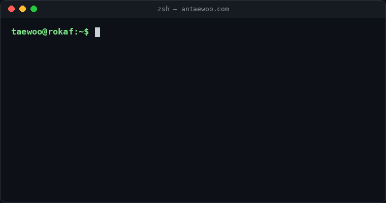

<!-- ============================== HEADER ============================== -->

 

<!-- ============================== ABOUT ============================== -->
## 🧑‍🚀 About Me

<table>
<tr>
<td width="55%" valign="middle">

</td>
<td width="45%" valign="top">

- 🎓 **서울과학기술대학교 (SeoulTech)** &nbsp;&nbsp;&nbsp;&nbsp;컴퓨터공학과 · 2023 ~
- 🎖️ **대한민국 공군 (ROKAF)** &nbsp;&nbsp;&nbsp;&nbsp;2025.03 ~ 2026.12 · 복무 중에도 개발 중 🫡
- 🤖 **Focus** — 에이전틱 워크플로우, 멀티에이전트 오케스트레이션, 온프레미스 RAG
- 🤝 **Claude와 페어 프로그래밍** — 설계 문서·ROADMAP·CLAUDE.md로 에이전트가 실행하는 개발 프로세스를 만듭니다
- 💬 **Ask me about** — LangGraph · vLLM · OpenSearch · FastAPI · Next.js
- 🌱 **Now** — 강화학습 공부 중 ([study log](https://github.com/AnTaewoo/reinforcement_learning_study_log))

</td>
</tr>
</table>

<!-- ============================== PROJECTS ============================== -->
## 🚀 Featured Projects

<table>
<tr>
<td width="50%" valign="top">

### 🏗️ [Foreman](https://github.com/AnTaewoo/foreman)
**HITL Multi-Agent Dev Platform**

GitHub 저장소와 Goal 한 문장을 넣으면 AI 에이전트 팀이 **Plan → Issue → Branch → PR**로 일하고, 사람은 *위험한 결정*(Plan 승인·PR 머지·의존성 추가)만 승인합니다.

- 🔗 서명된 append-only 이벤트 (해시 체인 · 이벤트 소싱)
- 📦 격리 컨테이너 워커 — DB·시크릿·토큰 미전달
- ♻️ 모든 GitHub 쓰기 멱등 + Dry-run 기본

</td>
<td width="50%" valign="top">

### 🛡️ [D.A.P — Defai Agent Platform](https://github.com/AnTaewoo/Defai_Agent_Platform)
**On-prem Agentic RAG Platform** · 🏆 경진대회 출품작

PDF·PPT·Excel·HWP·스캔본까지 파싱·청킹·색인하고, **프로젝트 격리 + 보안등급·visibility RBAC**이 적용된 멀티에이전트 RAG 챗봇과 문서·코드 생성 워크플로우를 제공합니다.

- 🔍 OpenSearch 단일 엔진 하이브리드 검색 (BM25 + k-NN)
- 🔐 검색 전 권한 pre-filter — 3중 게이트
- 🧠 사내 vLLM (Qwen2.5) · 등급→엔드포인트 라우팅

</td>
</tr>
<tr>
<td width="50%" valign="top">

### ✍️ [dev-to-blog](https://github.com/AnTaewoo/dev-to-blog)
**GitHub 저장소를 글감으로 삼는 정적 블로그**

"뭘 만들었는지는 GitHub이, 왜 만들었는지는 내가 쓴다." 저장소 수집 → 선택·작성 → sanitize된 HTML → Next.js SSG. **테스트 357개**로 계약·마크업을 게이트합니다.

</td>
<td width="50%" valign="top">

### ⚾ [LG Aimers 9th Hackathon](https://github.com/AnTaewoo/Lg_aimers_hackerthon_9th)
**투구 제구 성공 확률 예측**

147만 행 투구 데이터 + 2019~2024 Trackman 로그로 투구 직전 경기 상황·선수 이력 피처를 설계해 제구 성공 확률을 예측했습니다.

</td>
</tr>
</table>

<b>📂 More projects (click!)</b>

 

| Project | Description | Stack |
|:--|:--|:--|
| 🕒 [PureTimer](https://github.com/AnTaewoo/puretimer) | AI 기반 생산성 타이머 · [Front](https://github.com/AnTaewoo/puretimer-front) / [Back](https://github.com/AnTaewoo/puretimer-back) / [AI](https://github.com/AnTaewoo/puretimer-ai) | React · TS · Flask |
| 🧠 [ML Study @ SeoulTech](https://github.com/ml-study-seoultech/AnTaewoo) | 딥러닝 기초 아키텍처 직접 구현 스터디 | Python |
| 🎮 [RL Study Log](https://github.com/AnTaewoo/reinforcement_learning_study_log) | 강화학습 학습 기록 | Python |
| 📈 Stock Auto Alert Bot 🔒 | 텔레그램 주식 알림 자동화 | Python · Telegram |
| ⚡ Lightning Market Bot 🔒 | 실시간 마켓 모니터링 봇 | Python |
| 🎬 YouTube Shorts Generator 🔒 | YouTube 쇼츠 자동 생성기 | Python |
| 🗣️ AI English Teacher 🔒 | AI 영어 선생님 | LLM |
| 🪪 Identity NFT Shop 🔒 | 블록체인 마켓플레이스 로직 | Solidity |

<!-- ============================== STACK ============================== -->
## 🛠️ Tech Stack

**🤖 AI & LLM** 

**🧩 Backend & Data** 

**🎨 Frontend** 

**☁️ Infra & DevOps** 

<!-- ============================== ACTIVITIES ============================== -->
## 🌟 Activities & Leadership

| | Role | Organization |
|:-:|:--|:--|
| 🚀 | **CDO** (Chief Development Officer) | Aidenteti |
| 🌙 | **Manager** | Late Bird |
| 🏫 | **8th Generation Member** | IHSHS |
| 🧠 | **Member** | ML Study @ SeoulTech |
| 🏆 | **Participant** | LG Aimers 9th Hackathon |

<!--
## 📜 Certifications
| Certificate | Issuer | Date |
|:--|:--|:--|
| 자격증명 | 발급기관 | YYYY.MM |
-->

<!-- ============================== STATS ============================== -->
## 📊 GitHub Stats

<picture>
  <source media="(prefers-color-scheme: dark)" srcset="https://raw.githubusercontent.com/AnTaewoo/AnTaewoo/output/github-snake-dark.svg"/>
  <source media="(prefers-color-scheme: light)" srcset="https://raw.githubusercontent.com/AnTaewoo/AnTaewoo/output/github-snake.svg"/>
  
</picture>

<!-- ============================== FOOTER ============================== -->

### 💌 *"Always looking for help with AI Engineering. Let's grow together!"*

